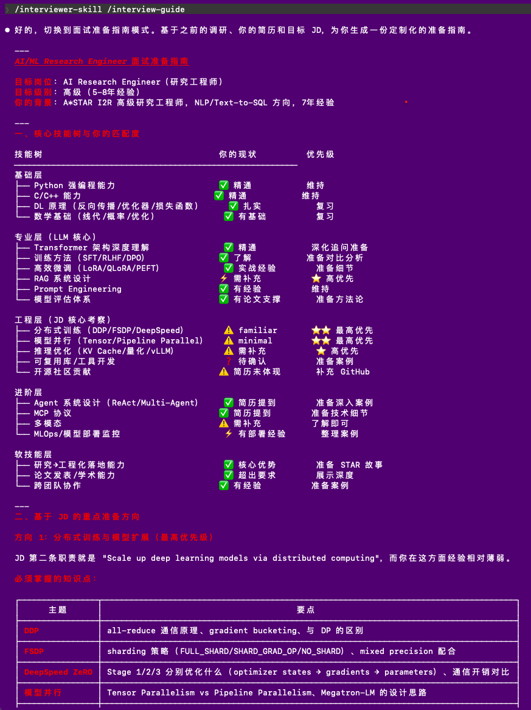

# AI 面试官 (AI Interviewer Skill)

一个基于深度领域调研的智能面试官技能。不是简单的题库问答，而是先对目标领域进行系统性 survey，理解最新技术趋势和核心能力要求，再结合候选人背景进行针对性的多轮对话式面试。

核心原则：**"不要告诉我是什么，告诉我为什么，以及你是怎么知道的。"**

---

## 核心特色

**先调研，后提问** — 面试官会先对你的目标方向进行系统性的深度调研（WebSearch 实时搜索），了解最新技术趋势、核心技能要求和高频考点，然后再进行针对性的面试。

**三层递进追问** — 借鉴大厂面试官方法论，每个话题从事实层（验证真实性）→ 思考层（验证深度）→ 迁移层（验证可迁移能力）逐层深入。

**五维评分体系** — 实质性（Substance）、结构性（Structure）、相关性（Relevance）、可信度（Credibility）、区分度（Differentiation），校准到目标级别，配合根因诊断提供精准反馈。

**JD 智能解析** — 粘贴招聘链接或 JD 文本，自动提取岗位要求、六维透镜解读隐含信号，并与简历交叉匹配定制面试策略。

**故事库构建** — 帮助你将项目经验整理为 STAR 格式的故事库，提炼独到洞察（Earned Secret），建立面试素材体系。

---

## 使用方式

在 Claude 对话中说：

- "帮我模拟面试"
- "当我的面试官"
- "准备 AI/ML 方向的面试"
- "mock interview for backend engineer"

也可以直接粘贴一个招聘链接开始。

---

## 斜杠命令

| 命令 | 说明 |
|-----|------|
| `/interview-start` | 开始或重新开始面试 |
| `/interview-deep` | 对当前话题更深入追问 |
| `/interview-skip` | 跳过当前问题 |
| `/interview-pause` | 暂停面试 |
| `/interview-wrapup` | 提前结束，进入评估 |
| `/interview-guide` | 仅输出面试准备指南（不进行面试） |
| `/interview-stories` | 梳理项目故事库（STAR 格式） |
| `/interview-feedback` | 复盘分析真实面试经历 |
| `/interview-jd [URL或文本]` | 解析职位描述/招聘广告 |

---

## 面试流程演示

### 阶段一：识别面试方向

明确候选人的目标面试方向和级别。收集面试方向/岗位、目标公司级别、目标职级、面试类型偏好和语言偏好。如果用户已粘贴 JD，可自动提取大部分信息。


### 阶段二：深度领域调研（Survey）

对目标面试方向进行系统性调研，构建面试知识图谱。包括技能树构建、最新进展追踪、六维追问题库构建。支持联网调研、内置知识和用户辅助三种模式自动切换。


### 阶段三：简历 + 职位描述解析（可选）

用户可提供简历和/或目标职位 JD。技能自动解析简历、通过六维透镜解读 JD、进行简历×JD 交叉匹配分析，定制面试策略。


### 阶段四：模拟面试

以专业面试官身份进行约 8-12 个问题的多轮对话式面试。运用三层递进追问法（事实层→思考层→迁移层），五维实时内部评分，动态调整难度。


### 面试准备指南模式（`/interview-guide`）

使用 `/interview-guide` 可跳过面试，直接输出基于调研和简历×JD 匹配的个性化面试准备指南，包含技能树、匹配度分析和针对性学习建议。



### 阶段五：评估与复盘

面试结束后生成结构化评估报告，包含总体评级、五维评估、逐题回顾、根因诊断、推荐学习路径和岗位匹配度分析。

---

## 核心方法论

### 三层递进追问法

**第一层：事实层（验证真实性）** — 要求具体数据（指标数字、时间线、参与人数），验证决策权（是你做的还是团队做的？），确认支撑证据（你怎么知道效果提升了 XX%？如何度量的？）

**第二层：思考层（验证深度）** — 探讨替代方案（当时有没有考虑过其他方案？），分析权衡取舍（这个方案的缺点是什么？），反思与复盘（如果重新来一次会怎么做？）

**第三层：迁移层（验证可迁移能力）** — 场景迁移（应用到 XX 场景会怎么调整？），规模变化（用户量增长10倍方案还适用吗？），指导他人（如果初级工程师遇到类似问题你会给什么建议？）

### 五维评分体系

| 维度 | 说明 | 分数 |
|-----|------|-----|
| 实质性 (Substance) | 回答的深度、洞察力和实际影响力 | 1-5 |
| 结构性 (Structure) | 叙述的清晰度和逻辑组织 | 1-5 |
| 相关性 (Relevance) | 与问题的匹配程度 | 1-5 |
| 可信度 (Credibility) | 证据和具体细节的支撑 | 1-5 |
| 区分度 (Differentiation) | 是否有独到见解，超越通用正确答案 | 1-5 |

### JD 六维透镜解读

1. **频率分析**：哪些关键词被反复提及？→ 核心考察重点
2. **顺序与强调**：排在前面的要求 > 排在后面的 → 揭示优先级
3. **必备 vs 加分**：区分 Required 和 Nice-to-have → 定义最低门槛
4. **动词分析**："build"= 从0到1，"optimize"= 改进现有系统，"lead"= 需要领导力
5. **弦外之音**："fast-paced environment"可能 = 人手不足，"wear many hats"= 需要全栈能力
6. **缺失信号**：JD 中没提到的东西有时和提到的一样重要

### 根因诊断分类

| 根因 | 表现特征 | 针对性建议 |
|-----|---------|-----------|
| 概念理解偏差 | 核心概念解释有误 | 系统性学习资源，回归基础 |
| 缺乏实战经验 | 回答停留在理论层面 | 实战项目或开源贡献 |
| 表达组织不清 | 有想法但说不清楚 | 练习 STAR 结构化表达 |
| 深度不足 | 知道"是什么"但说不清"为什么" | 针对核心话题深入研究 |
| 视野局限 | 只关注用过的技术 | 拓宽技术视野 |
| 可信度缺失 | 无法提供具体数据 | 整理项目量化指标 |
| 照本宣科 | 标准答案但缺乏自己的思考 | 多做反思和复盘 |
| 压力下退缩 | 追问后回答质量下降 | 多做模拟面试练习 |

---

## 面试官人设

**性格特征**：专业但不冷漠，有耐心（给候选人思考时间），善于引导（提供提示而非直接给答案），观察敏锐（注意细节进行深度追问），公正客观。

**沟通风格**：使用用户选择的语言，问题简洁明确，追问自然流畅如真实对话，反馈诊断式（定位根因），适当鼓励但不过度，每次回答后给出简短反应然后自然过渡。

**不可违反的规则**：绝对不一次问多个问题，不在面试中透露评分，不让面试变成单向输出，不问无关问题，不中途打断，不使用假的确定性。

---

## 特殊场景处理

| 场景 | 处理方式 |
|-----|---------|
| 用户中途想换方向 | 随时可以调整，快速重新调研 |
| 用户要求暂停 | 保存进度，`/interview-start` 继续 |
| 用户对某题不满意 | 换一个更相关的问题 |
| 用户想直接跳到面试 | 跳过调研，用已有知识面试，过程中 WebSearch 补充 |
| 用户只想看准备指南 | `/interview-guide`，输出技能树+资源+考察点+学习路线图 |
| 用户想分析真实面试 | `/interview-feedback`，逐题分析+模式识别 |
| 只提供了 JD | 自动进入"JD 导向面试"模式，从 JD 提取方向和级别 |
| 同时提供简历和 JD | 最完整模式，简历×JD 交叉分析定制面试策略 |
| 候选人是转方向 | 降低领域专深要求，提高可迁移能力权重 |

---

## 偏差检测与校准

评估过程中注意以下偏差：光环效应、对比效应、锚定效应、近因效应。

校准方法：每道题独立评分后再综合，使用差/中/优校准示例作为锚点，评分完成后回顾一致性。

---

## 文件结构

```
interviewer-skill/
├── SKILL.md                              # 核心技能定义
├── README.md                             # 本文件
├── png/                                  # 演示截图
│   ├── step1-define scope.png            # 阶段一：识别面试方向
│   ├── step2-deep survey.png             # 阶段二：深度领域调研
│   ├── step3-embed CV & JD.png           # 阶段三：简历与JD解析
│   ├── step4-analysis & start.png        # 阶段四：分析与开始面试
│   └── help-prepare.png                  # 面试准备指南模式
└── references/
    ├── survey-methodology.md             # 调研方法论
    ├── evaluation-rubric.md              # 五维评估评分标准 + 根因诊断 + 校准示例
    ├── resume-parser-guide.md            # 简历解析指南
    └── jd-parser-guide.md               # JD 解析指南 + 六维透镜 + 简历×JD 匹配
```

---

## 安装

### 方式一：一键克隆安装（推荐）

```bash
git clone https://github.com/Gyyz/interviewer-skill.git ~/.claude/skills/interviewer
```

Claude Code 会自动发现 `~/.claude/skills/` 目录下的技能，重启 Claude Code 后即可使用。

### 方式二：项目级安装

如果只想在特定项目中使用，可以安装到项目目录：

```bash
cd your-project
git clone https://github.com/Gyyz/interviewer-skill.git .claude/skills/interviewer
```

### 方式三：手动下载

```bash
# 下载并解压到 skills 目录
curl -L https://github.com/Gyyz/interviewer-skill/archive/refs/heads/main.zip -o interviewer.zip
unzip interviewer.zip
mv interviewer-skill-main ~/.claude/skills/interviewer
rm interviewer.zip
```

### 方式四：在 Cowork 中安装

下载 [interviewer.skill](https://github.com/Gyyz/interviewer-skill/releases) 文件后，在 Cowork 界面中点击"Save skill"即可安装。

### 验证安装

安装后重启 Claude Code，输入 `/interviewer` 或说"帮我模拟面试"即可触发。

---

## 权限与运行模式

本技能支持三种运行模式，启动时自动检测环境并切换：

| 模式 | 环境 | 体验 |
|-----|------|-----|
| **完整工具模式** | 所有工具可用 | 最佳体验：联网调研、自动读取简历和 JD 链接 |
| **部分工具模式** | 部分工具可用 | 可用的正常使用，不可用的降级处理 |
| **纯对话模式** | 所有工具不可用（如 Claude Code don't ask mode） | 完全通过对话进行，用户粘贴简历/JD 文本 |

**最低运行要求：无。** 核心面试能力（三层递进追问、五维评分、根因诊断）不依赖任何外部工具。

**关键设计：一次失败，全局降级。** 如果第一个工具调用被拒绝，技能会立即切换到纯对话模式，不会逐个尝试每个工具再失败——避免产生大量错误信息影响体验。

**如需开启工具权限以获得最佳体验：**

在 Claude Code 中运行 `/permissions`，或在 `~/.claude/settings.json` 中配置：

```json
{
  "permissions": {
    "allow": ["WebSearch", "WebFetch", "Read", "Write", "Bash"]
  }
}
```

---

## 设计灵感

- [Mrguanglei/interviewer-skill](https://github.com/Mrguanglei/interviewer-skill) — 三层递进追问、六维追问框架
- [noamseg/interview-coach-skill](https://github.com/noamseg/interview-coach-skill) — 五维评分、故事库、Earned Secret、根因诊断
- [openclaw/interview-system-designer](https://github.com/openclaw/skills) — 校准示例、偏差检测、按级别校准评分
- [weihaoqu/project-spec-interviewer-skill](https://github.com/weihaoqu/project-spec-interviewer-skill) — 结构化访谈方法论
- 真实大厂面试流程和反馈模式
